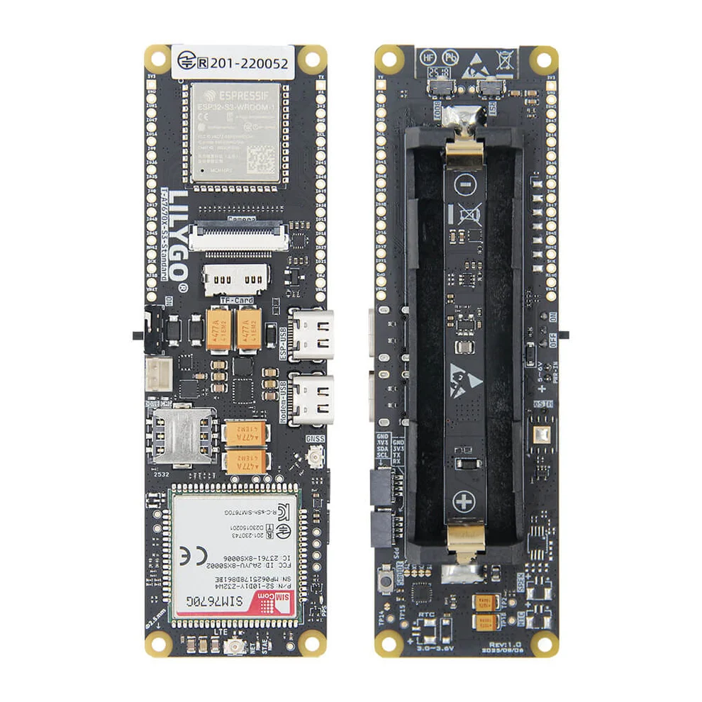
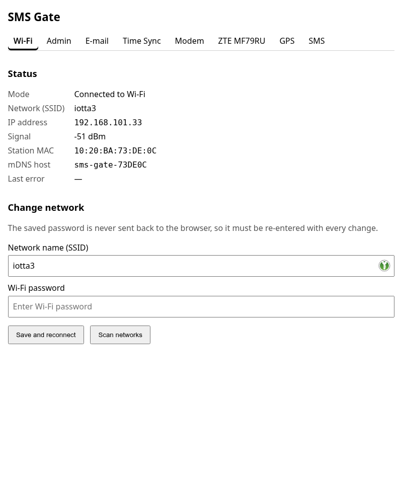
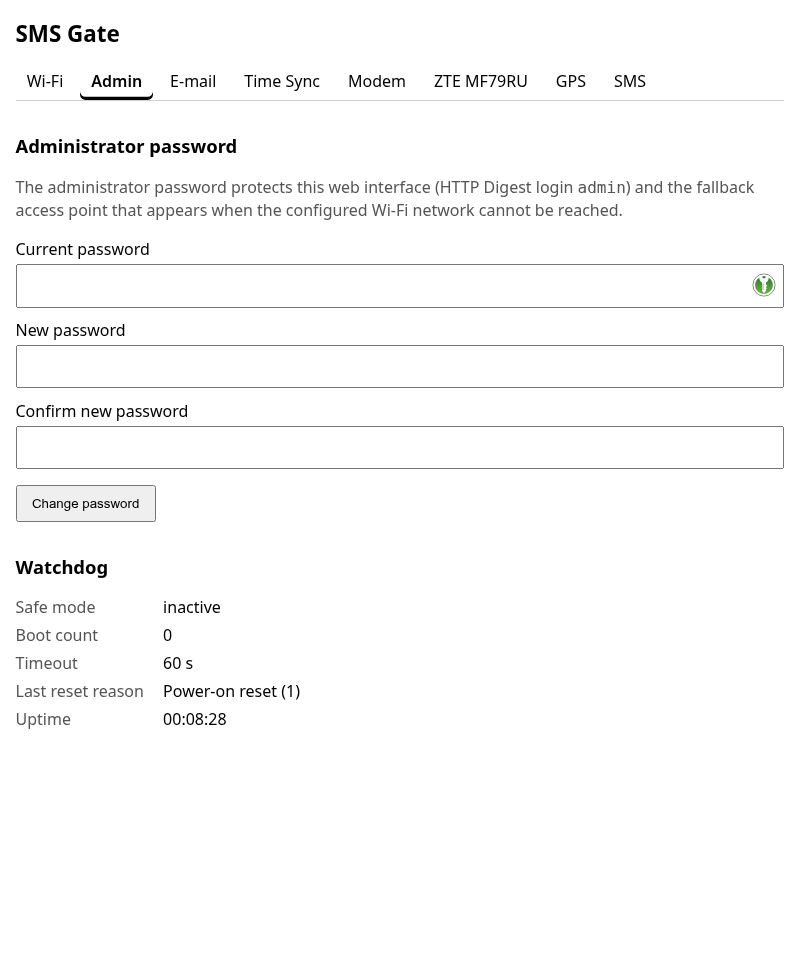
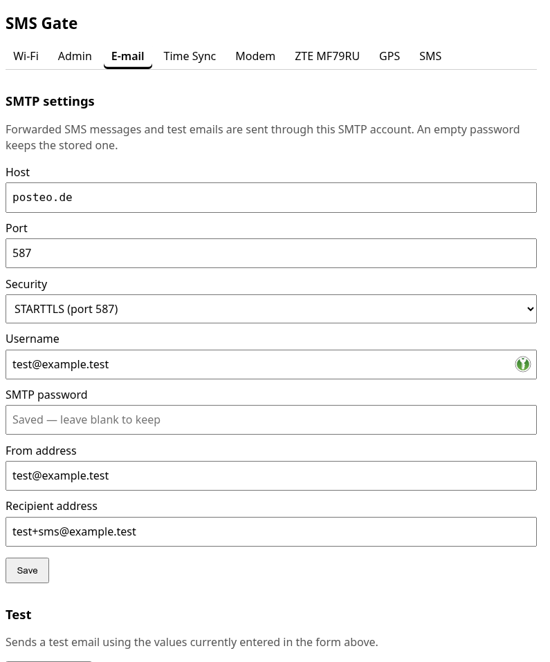
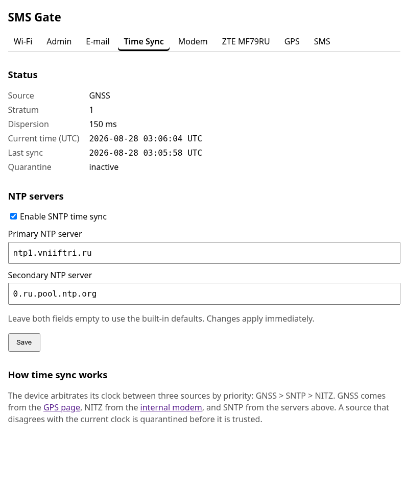
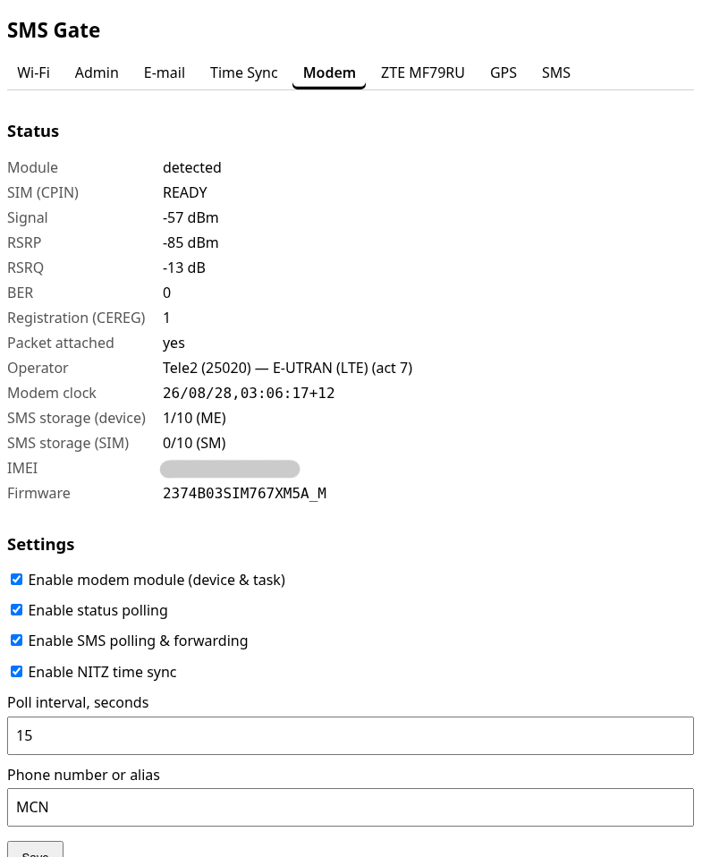
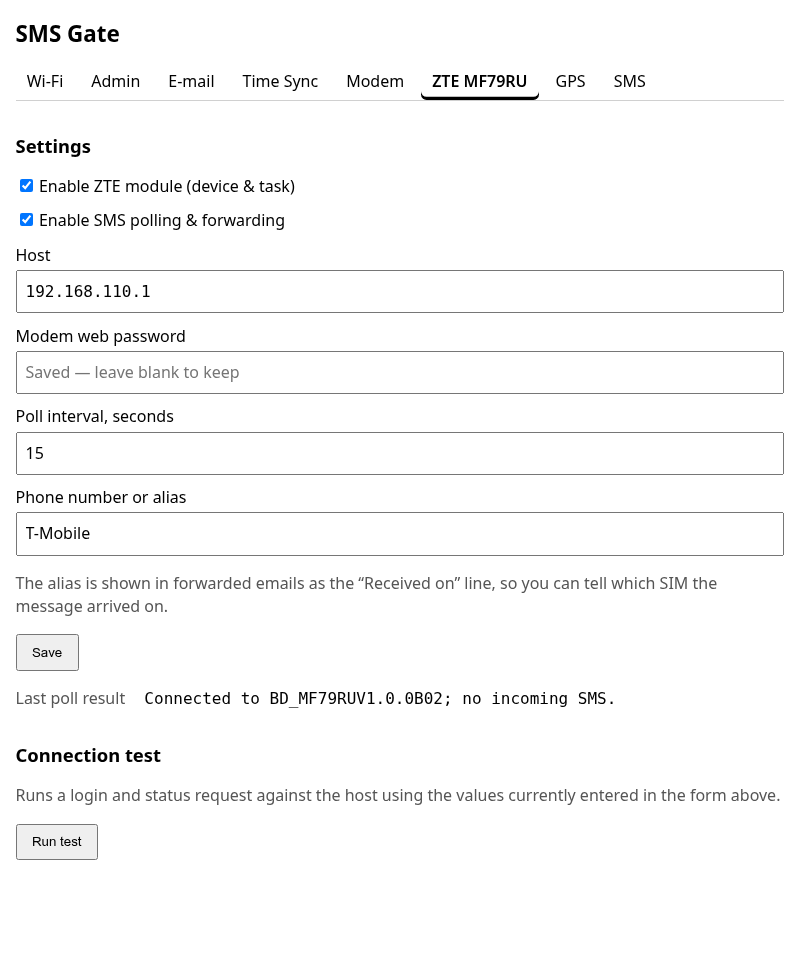
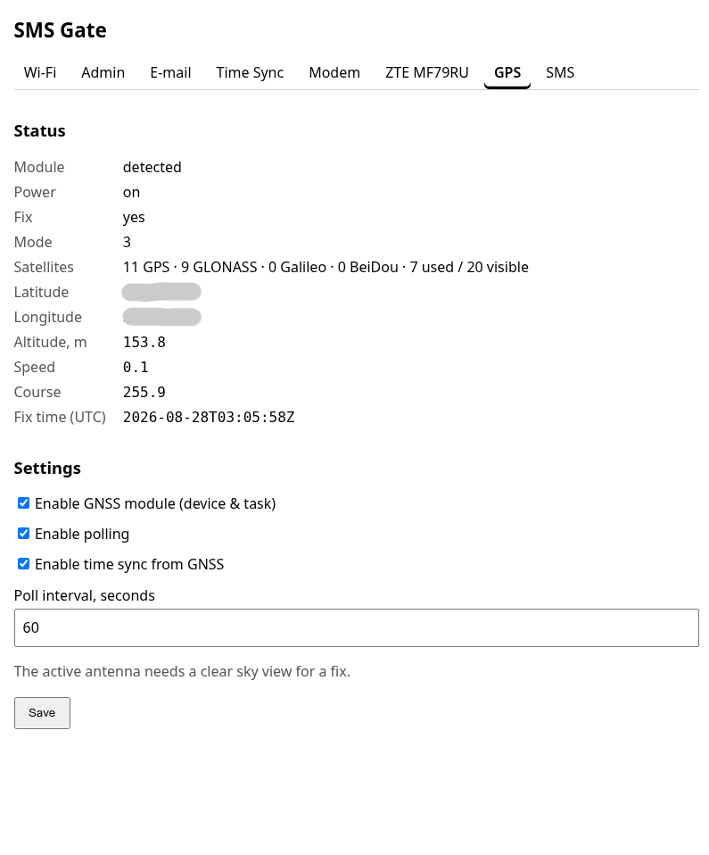
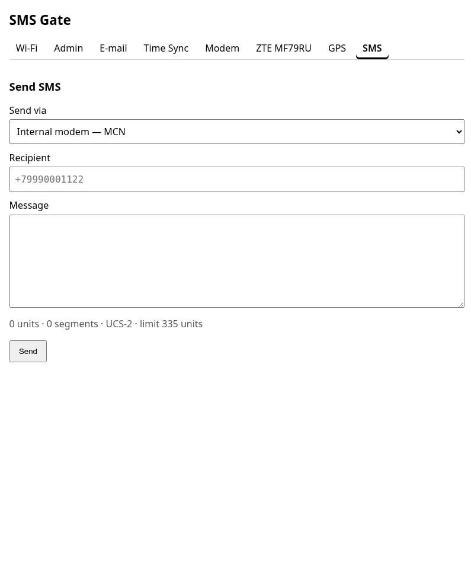

# LilyGO T-SIM7670G-S3 SMS Gate

Firmware for the LilyGO T-SIM7670G-S3 that turns the board into a small SMS and time gateway for a trusted local network. It can receive SMS messages through its built-in SIM7670G modem, forward them by email, and send SMS messages from its web interface.

The board can also use its GNSS receiver as a time source and provide time to devices on the local network.

Product page: <https://lilygo.cc/products/t-sim-7670g-s3>

<p align="center">
  
</p>

## What the firmware does

- Provides a local web interface for first-time Wi-Fi setup and ongoing administration.
- Receives SMS messages through the onboard SIM7670G modem and forwards them through a configured SMTP account. A message is removed from modem storage only after successful email delivery.
- Sends SMS messages through the onboard modem.
- Supports a ZTE MF79RU modem on the same network as an optional second SMS source and sender.
- Keeps time from GNSS when available, with SNTP and mobile-network time as fallbacks. It can serve time to local NTP clients.
- Protects the configured interface with an administrator password and can fall back to its own Wi-Fi access point when the saved network is unavailable.
- Stores configuration separately from the firmware, so a forgotten setup can be reset over USB without erasing the application.
- Uses a watchdog and safe mode: after repeated watchdog failures it keeps a protected local access point and HTTP diagnostics available while poll services stay stopped.

## First-time setup

On its first boot, the gateway creates an open Wi-Fi access point named `SMS-Gate-<MAC>` and opens a captive portal. Connect a phone or computer to that network. If the portal does not open on its own, use the access point IP address printed in the USB serial log.

The setup page asks for the Wi-Fi network name and password that the gateway should use, plus a new administrator password. The gateway tests the Wi-Fi connection before it saves the settings. Once connected, it closes the open access point and joins the configured network.

## Web interface

After setup, open the gateway at `http://sms-gate-<MAC>.local` or use the IP address shown in the USB serial log. The interface is intended for a browser on the same trusted network.

It has pages for:

- Wi-Fi connection and setup
- Administrator password and watchdog status
- SMTP email delivery
- Time synchronisation and NTP status
- SIM7670G modem status and settings
- Optional ZTE MF79RU modem settings
- GNSS status and settings
- Sending SMS messages

## Screenshots

<table>
  <tr>
    <td align="center"></td>
    <td align="center"></td>
  </tr>
  <tr>
    <td align="center">Wi-Fi</td>
    <td align="center">Admin</td>
  </tr>
  <tr>
    <td align="center"></td>
    <td align="center"></td>
  </tr>
  <tr>
    <td align="center">E-mail</td>
    <td align="center">Time Sync</td>
  </tr>
  <tr>
    <td align="center"></td>
    <td align="center"></td>
  </tr>
  <tr>
    <td align="center">Modem</td>
    <td align="center">ZTE MF79RU</td>
  </tr>
  <tr>
    <td align="center"></td>
    <td align="center"></td>
  </tr>
  <tr>
    <td align="center">GPS</td>
    <td align="center">SMS</td>
  </tr>
</table>

## Hardware you need

- LilyGO T-SIM7670G-S3
- A SIM card with SMS service
- LTE antenna and, if you use GNSS time, a GNSS antenna
- A Wi-Fi network with internet access for email delivery and SNTP
- SMTP account details for SMS forwarding
- Optional: a ZTE MF79RU reachable from the same local network

Use the board's **ESP-USB** connector for power, flashing, and serial logs. The **Modem-USB** connector is for modem service, not firmware uploads.

## Development setup

This repository uses [mise](https://mise.jdx.dev/) to provide the command-line tools. Install mise and Python 3, then from the repository root run:

```bash
mise install
mise exec -- arduino-cli config add board_manager.additional_urls \
  https://espressif.github.io/arduino-esp32/package_esp32_index.json
mise exec -- arduino-cli core update-index
mise exec -- arduino-cli core install esp32:esp32
```

Build the firmware:

```bash
mise run compile
```

The build generates `sms_gate/web_assets.h` from the files in `www/`. Run `mise run assets` after changing the web interface, or use `mise run compile`, which does it automatically.

Useful checks:

```bash
mise run test
mise run fmt:check
mise run lint
```

## Flashing the board

Connect the board through **ESP-USB**. This project targets `/dev/ttyACM0`.

```bash
mise run compile
mise exec -- arduino-cli upload -p /dev/ttyACM0 sms_gate
mise exec -- arduino-cli monitor -p /dev/ttyACM0 -c baudrate=115200
```

The upload normally enters download mode automatically. If it does not, hold **BOOT**, press and release **RST**, release **BOOT**, then run the upload command again.

## Resetting the configuration

Use this only when the administrator password is lost or the gateway needs to return to first-time setup. It removes Wi-Fi and administrator settings but leaves the firmware in place.

1. Connect through **ESP-USB**.
2. Hold **BOOT**, press and release **RST**, then release **BOOT**.
3. Erase the configuration partition:

```bash
esptool --chip esp32s3 --port /dev/ttyACM0 --before no-reset \
  erase-region 0x610000 0x6000
```

4. Reset the board. It will start the initial `SMS-Gate-<MAC>` access point again.

Do not run `erase-flash`: it also removes the firmware and boot data.

## References

- [LilyGO T-SIM7670G-S3 product page](https://lilygo.cc/products/t-sim-7670g-s3)
- [LilyGo modem-series documentation](https://github.com/Xinyuan-LilyGO/LilyGo-Modem-Series/blob/main/docs/en/esp32s3/sim7670g-s3/README.MD)
